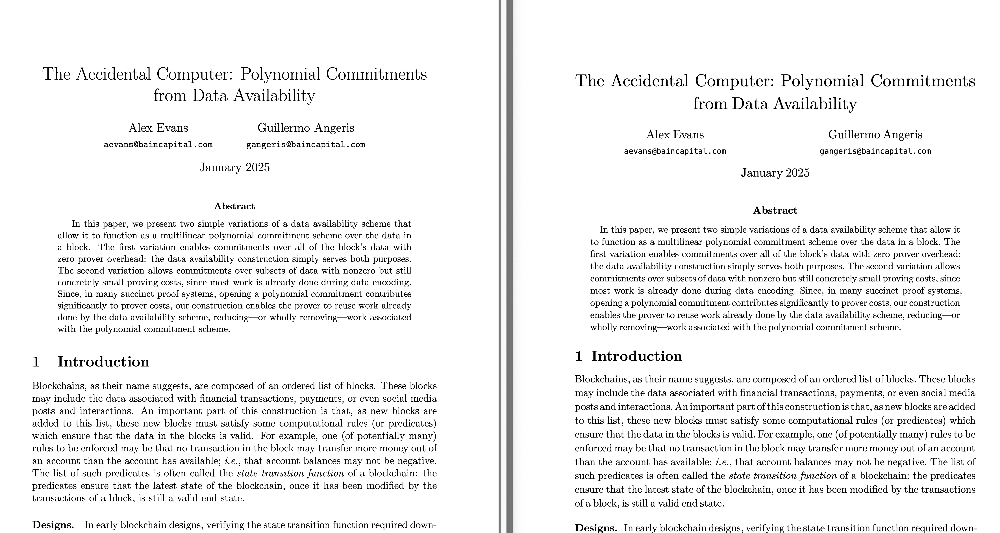

# Vanilla Fullpage TeX (now in Typst!)
Ever wanted to have the TeX template God (Don Knuth) intended, except
in Typst? Well, now you can!

## Preview

## Comments
Obviously it is not quite there yet, and probaly not yet usable as a daily driver, but for short
notes and stuff, it should be ok.

With that said, if there's any rough edges etc, let me know or feel free to PR.